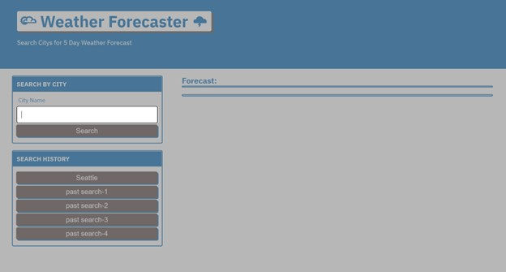
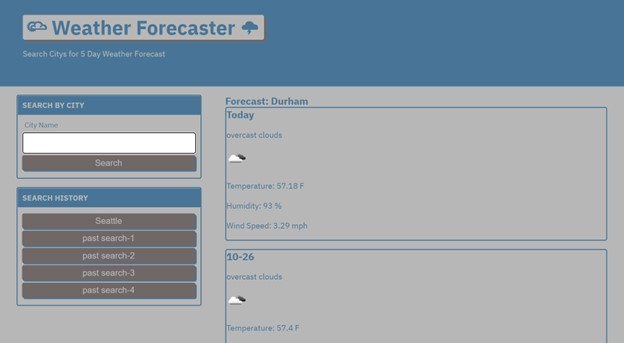

# Weather-Forecatser-UNC-M6---Zac-Ellis
## Description

Weather forecast application for module 6 challenge

## Installation

N/A

## Usage

Click on text boxes to enter daily events. 
Hit save button to save activities to local storage. 

## Credits

N/A

## License

Please refer to the LICENSE in the repo.

---
## Screenshots
Useage

## Deployed Application
https://zellis117.github.io/Weather-Forecatser-UNC-M6---Zac-Ellis/ 
